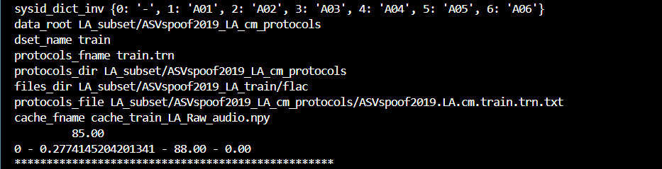

# 🔍 Top 3 Audio Deepfake Detection Models

This section outlines the three most promising models for real-time audio deepfake detection, particularly suited for detecting AI-generated human speech in real conversations.

---

## ✅ 1. RawNet2

- **📌 Key Technical Innovation**:
  - End-to-end model operating directly on **raw audio waveforms**
  - Uses deep **residual CNN blocks** followed by **GRU layers**
  - Joint optimization of **speaker verification** and **anti-spoofing**

- **📈 Performance**:
  - EER: ~0.24% on ASVspoof 2019 LA
  - EER: **1.12%**, t-DCF: **0.033** (ASVspoof 2021 LA)

- **🚀 Why Promising**:
  - No need for hand-crafted features (e.g., MFCCs or spectrograms)
  - Strong **generalization** against unknown attacks
  - **Lightweight architecture** supports near real-time inference
  - Good baseline and reproducibility

- **⚠️ Limitations**:
  - Raw audio requires **careful normalization**
  - Sensitive to **noisy/uncontrolled environments** (mitigable via augmentation or preprocessing)

- **📦 Dataset**: [ASVspoof 2019 LA](https://datashare.ed.ac.uk/handle/10283/3336)
- **🔗 Repo**: [github.com/eurecom-asp/rawnet2-antispoofing](https://github.com/eurecom-asp/rawnet2-antispoofing)

---

## ✅ 2. AASIST (Audio Anti-Spoofing using Integrated Spectro-Temporal features)

- **📌 Key Technical Innovation**:
  - Leverages **Spectro-Temporal Graph Attention Networks (GATs)**
  - Captures both **local time-frequency features** and **global structure**
  - Fuses topological and spectral information for improved robustness

- **📈 Performance**:
  - EER: **0.83%**, t-DCF: **0.028** (ASVspoof 2021 LA)

- **🚀 Why Promising**:
  - Robust against a wide range of spoofing techniques, including **unseen attacks**
  - Attention-based architecture supports **better generalization**
  - Optimizable for **online detection** scenarios

- **⚠️ Limitations**:
  - Requires **spectrogram preprocessing**
  - **Heavier model** than RawNet2, less ideal for edge devices

- **📦 Dataset**: [ASVspoof 2021 LA](https://datashare.ed.ac.uk/handle/10283/3336)
- **🔗 Repo**: [github.com/clovaai/aasist](https://github.com/clovaai/aasist)

---

## ✅ 3. LFCC-GAN + LCNN

- **📌 Key Technical Innovation**:
  - Uses **Linear Frequency Cepstral Coefficients (LFCC)** as input
  - Employs a **Light CNN (LCNN)** with **GAN-style adversarial training**
  - Designed to boost generalization across attack types

- **📈 Performance**:
  - Competitive results on ASVspoof 2019 and 2021 datasets
  - EER and t-DCF values comparable to SOTA models (exact values vary per run/dataset)

- **🚀 Why Promising**:
  - **GAN-based training** helps detect subtle artifacts
  - Especially useful for **real conversations** with nuanced manipulation
  - LFCC features are **less overfit-prone** than spectrograms

- **⚠️ Limitations**:
  - **Training instability** due to GAN architecture
  - Heavier and more complex to tune than RawNet2
  - Less suitable for low-latency, on-device detection

- **📦 Dataset**: [ASVspoof 2019/2021](https://datashare.ed.ac.uk/handle/10283/3336)
- **🔗 Repo**: Likely integrated in various academic implementations (custom integration required)

---

## 🏆 **Top Pick: RawNet2**

RawNet2 stands out due to its:

- Simplicity (works on raw audio directly)
- Speed (lightweight enough for near real-time)
- Strong performance even on unknown attacks
- Ease of integration for production or online systems

It’s a solid foundation for prototyping a real-time audio deepfake detection system with room for further enhancement and deployment optimization.

---


# Audio Deepfake Detection - RawNet2 Implementation

The model implemented here is based on **RawNet2**, a convolutional recurrent neural network architecture specifically designed for speaker verification and spoofing detection. The goal of this project was to explore its effectiveness on the **ASVspoof2019** Logical Access (LA) dataset.

---

## 🚀 Overview

This project implements a mini version of RawNet2 to:
- Load and preprocess raw audio `.flac` files
- Use a subset of the ASVspoof2019 LA dataset to reduce training time
- Run a small-scale training loop for deepfake classification

---

## 🛠 Project Structure

```
├── LA_subset/                        # Mini subset of ASVspoof2019-LA dataset
│   ├── ASVspoof2019_LA_cm_protocols/  # Protocol files (train, dev, eval)
│   ├── ASVspoof2019_LA_train/flac     # Training audio samples
│   ├── ASVspoof2019_LA_dev/flac       # Dev audio samples
│   └── ASVspoof2019_LA_eval/flac      # Evaluation audio samples
├── main.py                           # Training + evaluation script
├── model.py                          # RawNet2 model definition
├── data_utils_LA.py                  # Dataset loading and preprocessing
├── model_config_RawNet2.yaml         # RawNet2 model config
├── requirements.txt                  # Python dependencies
└── README.md                         # This file
```

---

## 💻 Setup Instructions

### 1. Clone the Repo
```bash
git clone https://github.com/ab-ark/Momenta-Audio-Deepfake-Detection
cd Momenta-Audio-Deepfake-Detection
cd rawnet2-antispoofing
```

### 2. Create and Activate Environment
```bash
python3 -m venv venv
source venv/bin/activate  # For Linux/Mac
# OR
venv\Scripts\activate     # For Windows
```

### 3. Install Dependencies
```bash
pip install -r requirements.txt
```

### 4. Dataset Setup
Place your subset of the ASVspoof2019-LA dataset under a folder named `LA_subset` in the root of the repo. Structure it as shown above.

You can also create a subset manually by copying a few `.flac` files from the official dataset into the respective `train`, `dev`, and `eval` folders and ensuring the protocol files list only those.

---

## 🧪 Usage Guide

### ✅ Train the Model
```bash
python main.py \
  --batch_size 4 \
  --num_epochs 2 \
  --comment "mini_test" \
  --features Raw_audio \
  --database_path LA_subset \
  --protocols_path LA_subset/ASVspoof2019_LA_cm_protocols
```

You should see logs like:
```

0 - 0.27 - 88.00 - 0.00
```

### 📁 Output Files
- `models/` — Saved checkpoints
- `logs/` — TensorBoard logs
- `cache_*.npy` — Preprocessed audio cache files

To visualize training:
```bash
tensorboard --logdir logs/
```

---

## 🧠 Model Highlights

- **RawNet2** architecture combines sinc-based convolution layers and GRU for temporal modeling.
- End-to-end learning directly from raw waveform
- Lightweight config: Reduced number of samples for fast experimentation

---

## 📝 Notes

This repo is a **lightweight proof-of-concept**, created to demonstrate:
- Familiarity with audio deepfake datasets
- Ability to modify and run an existing deepfake detection pipeline
- Writing clean, reproducible ML code for real-world use

---

## 🤔 Gotchas

- Ensure `.flac` files listed in protocols actually exist
- Paths must match WSL or local file system structure correctly
- If training accuracy is high but dev accuracy is 0, try increasing `sample_size` or check for imbalance in `dev` protocol

---


